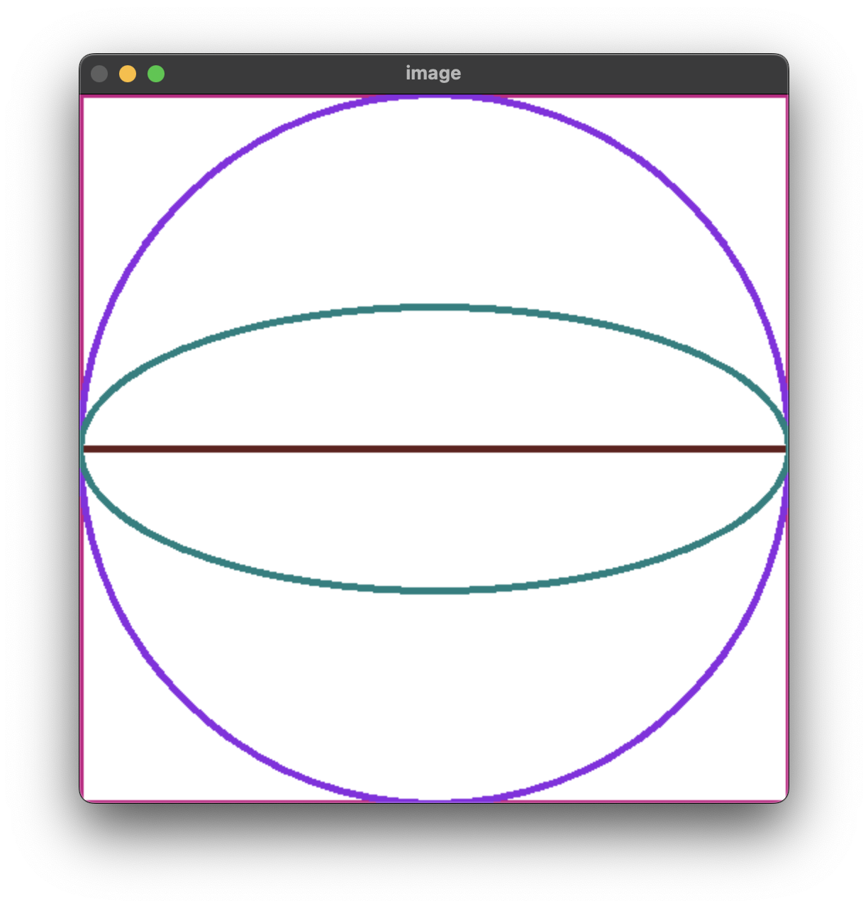

# ControloneAi
## 1.python script on face detection of a person using haar cascade and openCV.
### OUTPUT:

## 2.geometrical shapes - line, rectangles, ellipses, circles using python and openCV
### OUTPUT:

